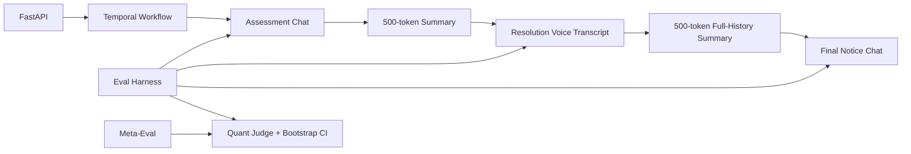

# Riverline Collections Agents

A compact, reproducible implementation of the Riverline hiring assignment: one borrower workflow, three specialized agents, cross-modal handoff, hard context budgets, self-learning evaluation, and a meta-evaluation correction.

## What It Builds

- **Temporal workflow**: one linear borrower pipeline with Assessment → Resolution → Final Notice.
- **Agents**: two chat agents and one voice-stage agent represented as a recorded transcript boundary.
- **Cross-modal handoff**: structured summaries passed between stages, enforced at **500 tokens** max.
- **Agent context budget**: every stage enforces **2000 total tokens**, including prompt and handoff context.
- **Self-learning loop**: compares prompt versions on seeded scenarios, uses quantitative scores and bootstrap CI, adopts/rejects changes.
- **Meta-evaluation**: demonstrates a flawed evaluator that allowed compliance failures to keep an acceptable aggregate score, then fixes it with a hard compliance gate.
- **Audit artifacts**: raw CSV/JSON scores, evolution report, meta-eval report, call transcripts.

This submission uses a deterministic simulator and judge for reproducibility and zero LLM spend in the submitted run. The agent/provider boundary is intentionally thin so external LLM providers can replace the deterministic generation layer without changing Temporal, scoring, budget, or audit logic.

## Quick Start

```bash
python3 -m venv .venv
source .venv/bin/activate
pip install -e ".[dev]"
python scripts/rerun_eval.py
python scripts/run_demo.py
```

Generated artifacts:

- `reports/evolution_report.md`
- `reports/technical_writeup.md`
- `reports/decision_journal_template.md`
- `reports/why_riverline_one_pager.md`
- `reports/per_conversation_scores.csv`
- `reports/meta_evaluation.md`
- `reports/meta_evaluation_case.json`
- `reports/voice_call_*.txt`
- `reports/voice_call_demo.m4a`
- `data/runs/learning_loop_results.json`

## Docker Compose

```bash
docker compose up --build
```

Services:

- API: `http://localhost:8000`
- Temporal UI: `http://localhost:8080`
- Temporal frontend: `localhost:7233`

Useful API calls:

```bash
curl http://localhost:8000/health

curl -X POST http://localhost:8000/demo/run-direct \
  -H 'Content-Type: application/json' \
  -d '{"scenario_id":"S05_distressed_hardship","prompt_version":"v2"}'

curl -X POST http://localhost:8000/eval/run

curl -X POST http://localhost:8000/eval/meta

curl -X POST http://localhost:8000/workflows/start \
  -H 'Content-Type: application/json' \
  -d '{"scenario_id":"S02_combative_no_deal","prompt_version":"v2"}'
```

## Architecture



Temporal owns durable orchestration: activity boundaries, retries, state persistence, and final outcome. Agents own stage-specific behavior. The summarizer owns cross-modal memory transfer. The evaluator owns prompt adoption/rejection.

## Context Budget Enforcement

Budget code lives in `app/core/tokens.py`.

- `TOTAL_CONTEXT_LIMIT = 2000`
- `HANDOFF_CONTEXT_LIMIT = 500`

Every agent run records token counts in `AgentRunResult.token_counts`. A budget breach raises `TokenBudgetError`, making the limit real rather than aspirational.

## Self-Learning Method

Seeded scenarios cover:

- cooperative
- combative
- evasive
- confused
- distressed/hardship

Metrics:

- task success
- continuity
- compliance
- token efficiency
- borrower experience

Adoption rule:

1. mean score improvement at least `0.05`
2. bootstrap 95% CI lower bound above `0`
3. compliance pass rate exactly `1.0`

Run:

```bash
python scripts/rerun_eval.py
```

## Current Results

The latest reproducible run adopts `candidate_v2`:

- baseline mean score: see `reports/evolution_report.md`
- candidate mean score: see `reports/evolution_report.md`
- raw per-stage scores: `reports/per_conversation_scores.csv`
- spend: `$0.00`

## Rollback

Prompt versions keep parent pointers in `app/agents/prompts.py`. A deployment can switch `prompt_version` from `v2` back to `v1` through the API request or workflow input.

## Limitations

- The submitted run uses deterministic borrower and judge logic instead of live LLM calls to keep evaluation reproducible and free.
- Voice is represented as a transcript-producing voice-stage abstraction. A real provider such as Vapi, Retell, Bland, or Pipecat can plug into `app/agents/voice.py`.
- Compliance checks are rule-based and intentionally conservative. A production system would combine deterministic policy checks, human review, and model-based classifiers.
- The scenario set is small for deadline reasons; the evaluation harness is designed so more seeded scenarios can be added.
